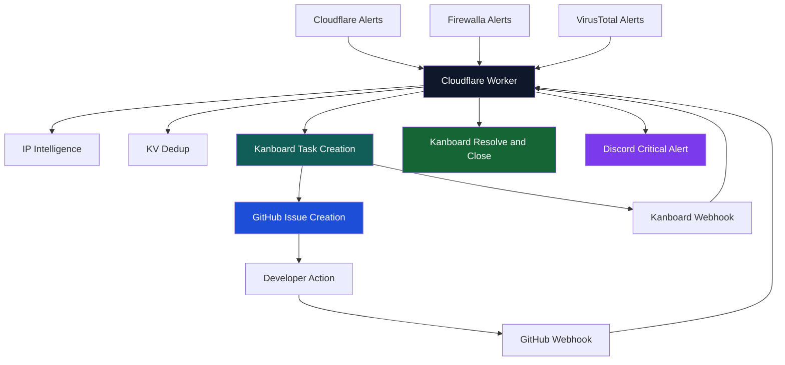

# Diagram

```mermaid
flowchart TD
    A[Cloudflare Alerts] --> D[Cloudflare Worker]
    B[Firewalla Alerts] --> D
    C[VirusTotal Alerts] --> D

    D --> E[IP Intelligence]
    D --> F[KV Dedup]
    D --> G[Kanboard Task Creation]
    G --> H[GitHub Issue Creation]
    H --> I[Developer Action]
    I --> J[GitHub Webhook]
    J --> D
    D --> K[Kanboard Resolve and Close]

    G --> L[Kanboard Webhook]
    L --> D
    D --> M[Discord Critical Alert]

    style D fill:#0f172a,color:#ffffff
    style G fill:#115e59,color:#ffffff
    style H fill:#1d4ed8,color:#ffffff
    style K fill:#166534,color:#ffffff
    style M fill:#7c3aed,color:#ffffff
```
