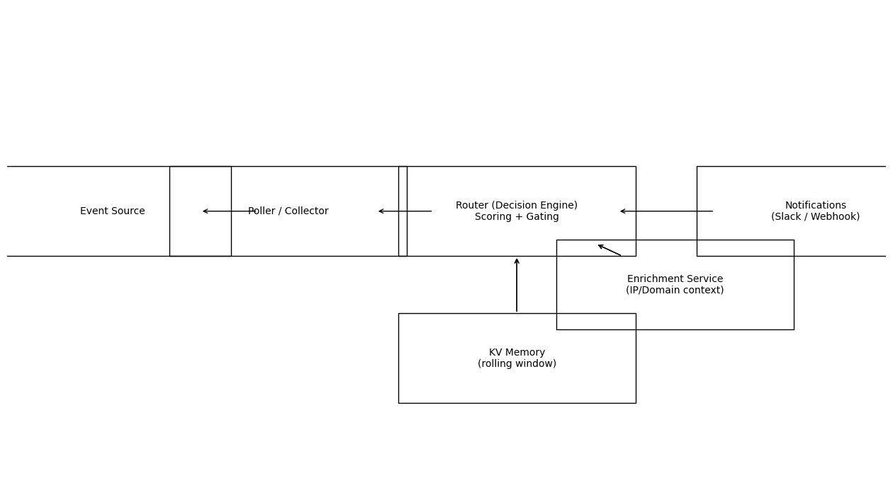

# Real-Time Security Alerting Framework (Serverless)

A public, sanitized reference implementation of an event-driven security alerting pipeline:
- Ingests security events
- Enriches indicators (IP/domain)
- Scores risk
- Stores short-term indicator memory
- Posts high-signal alerts to collaboration tools (e.g., Slack)

> This repo is a **portfolio / reference** version. It contains **no production secrets, IDs, tokens, or internal URLs**.

---

## Architecture

### Components
- **Event Source**: security platform / firewall / edge service
- **Poller / Collector**: periodically pulls events from an API and forwards to the router
- **Router (Decision Engine)**: applies scoring rules, rate limits/noise gates, and routes notifications
- **Enrichment Service**: looks up IP/domain context (geo, ASN/org, privacy flags) via a provider
- **KV Memory**: short-term state (e.g., first/last seen, counts)
- **Notification Sink**: Slack (threads), email, webhooks, etc.

---

## What’s Included
- ✅ Clean, documented architecture
- ✅ Risk scoring model (threshold-based)
- ✅ Short-term indicator memory design
- ✅ Digest + heartbeat patterns (low noise)
- ✅ Secure internal service-to-service auth pattern (shared secret)

## What’s Intentionally Excluded
- ❌ Any real tokens, secrets, channel IDs, account IDs, or URLs
- ❌ Production worker code tied to a real environment
- ❌ Customer / org identifiers

---

## Scoring (Example)

A simple thresholding approach:
- **< 40**: silent
- **40–69**: thread reply (adds context)
- **≥ 70**: escalation (high priority)

Example signals:
- Provider base reputation score
- Geo allowlist violations (policy-driven)
- Repeat activity within a rolling window
- High-signal event types (e.g., malware/intrusion)

See: `docs/scoring-model.md`

---

## Storage (Indicator Memory)

Use a KV store to track indicators for a rolling window (e.g., 7 days):
- `first_seen`
- `last_seen`
- `count_window`
- `last_score`

This enables “first seen” and “repeat offender” behavior without duplicating vendor reporting.

---

## Setup (High Level)

This repo is a reference design. To implement in your environment:
1. Deploy router and enrichment services (serverless)
2. Add KV binding for indicator memory
3. Configure webhook/ingest auth between services
4. Configure notification sink (Slack bot token, channel mapping)
5. Tune scoring thresholds for your noise tolerance

---

## License
MIT
